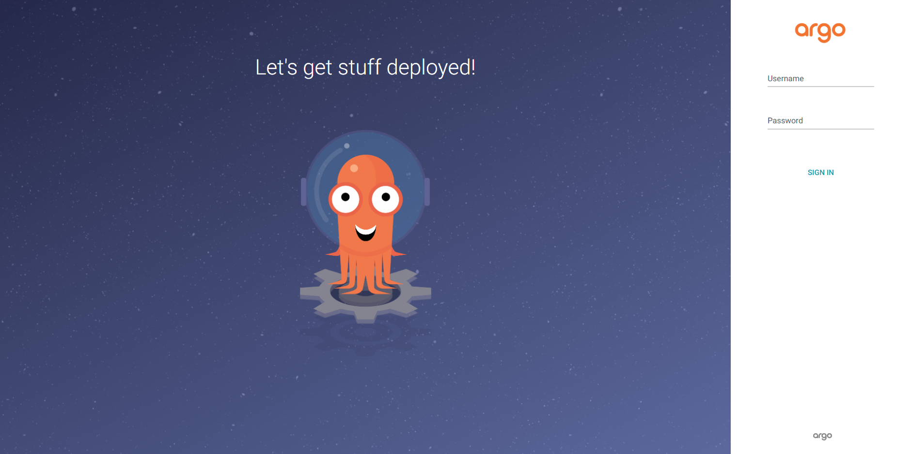
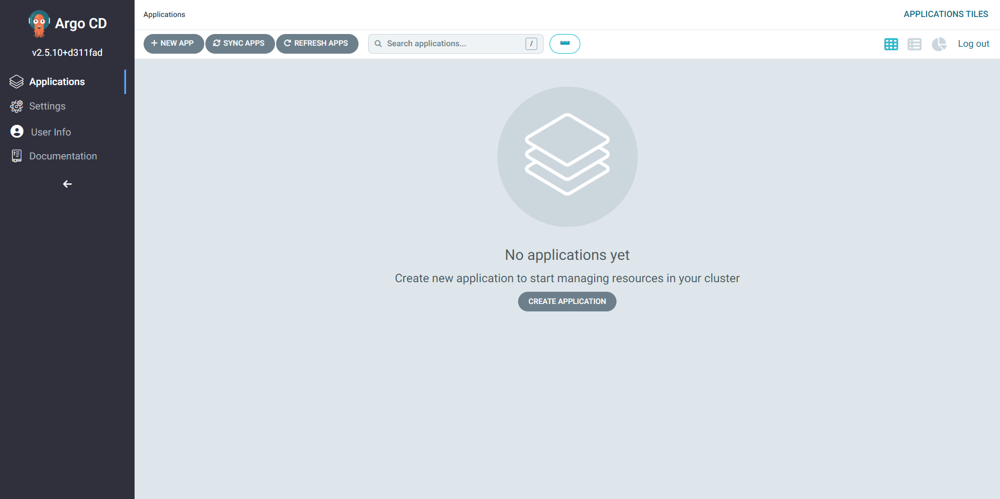

# Infra-cloud-gke

# 1. Dockeriser cette stack

Téléchargement du répertoire de l'application "voting-app"
/: git clone  https://github.com/...
fgg

Création d'un namespace
kubectl create namespace vote

# 2. Création des fichiers de déploiement et service

# 3. Vérification de l'accès à l'application depuis l'extérieur

Expoer les services vote et result à l'exterieur

Accès au service vote depuis l'extérieur via l'adresse http://35.245.239.198:5000/
image.png

Accès au service result depuis l'extérieur via l'adresse http://34.86.26.21:5001/
image.png

# Partie GitOps

# 1. Installation de ArgoCD
Création d'un namespace
kubectl create namespace argocd

Télécharger et appliquer le fichier d'installation d'ArgoCD
kubectl apply -n argocd -f https://raw.githubusercontent.com/argoproj/argo-cd/stable/manifests/install.yaml

Vérification de l'état des pods
kubectl get all -n argocd

Exposition du port au service et transfert vers l'hôte local
kubectl port-forward svc/argocd-server -n argocd 8080:443

Accéder à ArgoCD via l'adresse  https://localhost:8080/

Le identifiant par défaut sont:
login: admin
Pour le mot de passe il faut rentrer la commande suivante pour l'obtenir

kubectl -n argocd get secret argocd-initial-admin-secret -o jsonpath="{.data.password}" | base64 -d

==> résultat:  0XUdqTOqEZErItY0

ArgoCD 
login: admin
password:  0XUdqTOqEZErItY0

server name:   pod/argocd-server-6d65f8d8f5-p444l
                   argocd-server-6d65f8d8f5-p444l

Installation de ArgoCD CLI sur Windows (Powershell)

> choco install argocd-cli

Connexion à ArgoCD

kubectl get service argocd-server -n argocd --output=jsonpath='{.status.loadBalancer.ingress[0].ip}'

argocd login $(kubectl get service argocd-server -n argocd --output=jsonpath='{.status.loadBalancer.ingress[0].ip}') --username admin --password $(kubectl -n argocd get secret argocd-initial-admin-secret -o jsonpath="{.data.password}" | base64 -d; echo) --insecure

# Ajout du repos Git

argocd repo add git@github.com:ArinsF/Infra-cloud-gke.git --ssh-private-key-path ~/.ssh/id_rsa

